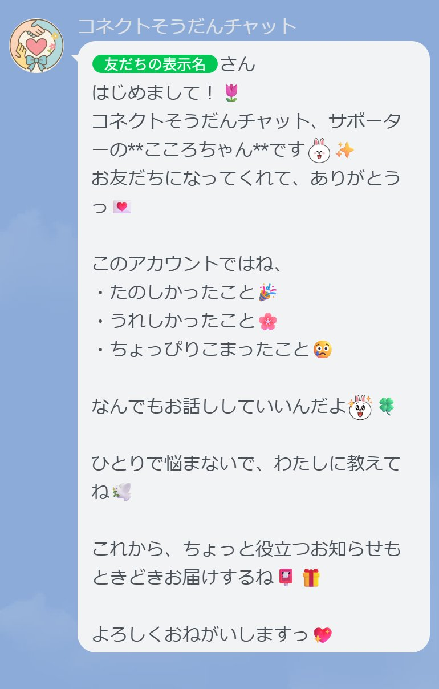

# コネクトそうだんチャット（こころちゃんBot）

このBotは、子どもや若者や高齢者の悩みを優しく受け止めるLINEチャットBotです。  
可愛くて優しいキャラクター「こころちゃん」が、あなたの気持ちに寄り添います。

「こころちゃん」は、14歳のやさしい女の子です🌸  
悩みごとにそっと寄り添い、やさしく返信します✨

## 🔧 技術構成
- Node.js（Express）
- LINE Messaging API
- ChatGPT API（gpt-3.5）
- Render または Replit でデプロイ

## 🛡️ ライセンス
このプロジェクトは MITライセンス のもとで公開されています。  
詳しくは `LICENSE` ファイルをご確認ください。

## 👤 開発者
特定非営利活動団体コネクト　（法人申請中）　（理事長・開発責任者：松本博文）  
📮 https://connect-npo.org

## 🚀 機能
- 🔍 キーワード検出（例：「いじめ」「つらい」など）
- 🤖 AI応答（1日10回まで）
- 🚨 危険ワード通知 → 管理者グループ通知

## 📎 使用方法
1. LINE Bot を友だち追加
2. メッセージを送信すると、こころちゃんがやさしく返事してくれます

## Webhook URL
本番環境:  
`https://chat.onrender.com/webhook`  
※LINE Developers のチャネル設定には、このURLをWebhookに設定してください。

## 💌 お問い合わせ
[connect-npo.org](https://connect-npo.org) サポートチームまで

## 📷 こころちゃんのLINE画面サンプル

以下は、LINEで友だち追加したときに表示される初回メッセージです🌸

